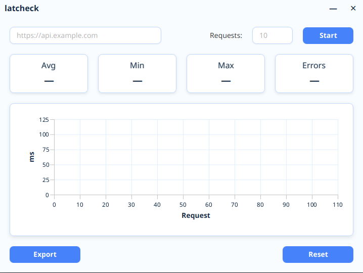

# latcheck

**LatCheck** - JavaFX application for measuring and analyzing network latency of HTTP requests.

## Project Goals

- Measure HTTP service response times
- Visualize latency statistics
- Analyze errors and unstable responses
- Export data to CSV format

## Features

- Asynchronous execution of a large number of requests (in plans)
- Latency chart (Line Chart)
- Statistics: average, minimum, maximum response time
- Error count tracking
- One-click export to .csv

## UI



## Requirements

- **Java 17+**
- **Maven 3.6+**

## Run

```bash
mvn javafx:run
